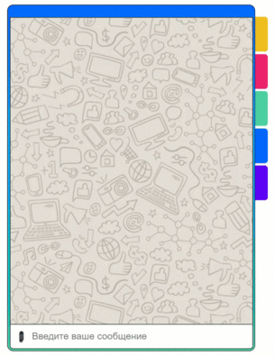
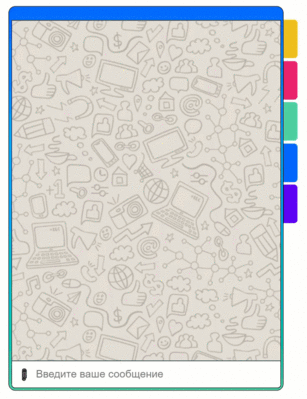
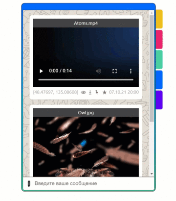
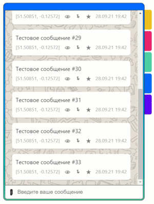
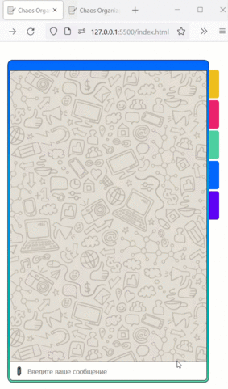
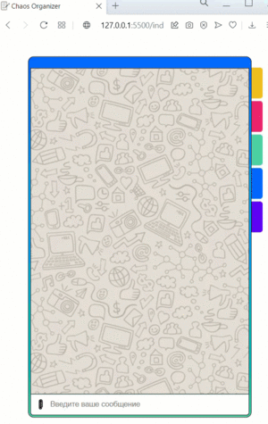
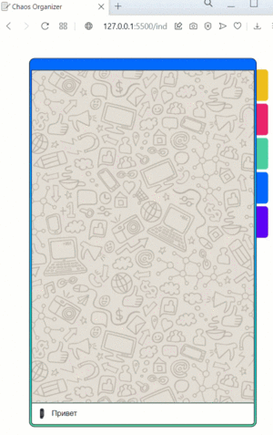
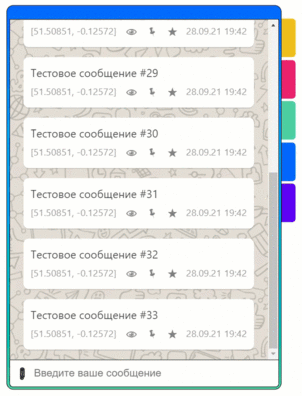
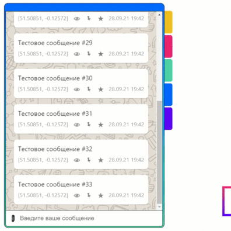
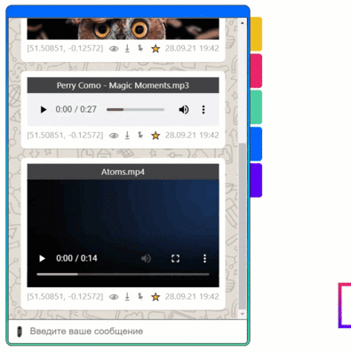

## Записная книжка (Frontend часть)

**🛠️ Стек**

JS + CSS + HTML

**⚙️ Реализовано**:

  -  Сохранение в истории ссылок и текстовых сообщений


  -  Кликабельные ссылки (то, что начинается с `http://` или `https://`)


  -  Сохранение в истории изображений, видео и аудио (как файлов) - через Drag & Drop и через иконку загрузки (скрепка)





  -  Скачивание файлов (на компьютер)



  -  Ленивая подгрузка: сначала подгружаются последние 4 сообщения, при прокрутке вверх подгружаются следующие 4 и т.д.



  -  Синхронизация - если приложение открыто в нескольких окнах (вкладках), то контент синхронизируется;



  -  Отправка геолокации;





  -  Закрепление (pin) одного из сообщений (крепится к верхней части страницы)



  -  Добавление сообщения в избранное и вкладка для его просмотра



  -  Просмотр вложений по категориям: текст, изображения, аудио, видео с помощью соответствующих вкладок



Backend часть приложения: https://github.com/yuriyvyatkin/notepad-backend

**📚 Инструкция по работе с проектом**

##### 1. Клонирование

```
git clone https://github.com/yuriyvyatkin/notepad-frontend.git
```

```
cd notepad-frontend
```

##### 2. Установка зависимостей

```
npm install
```

##### 3. Запуск

```
npm build
```

```
npm start
```
